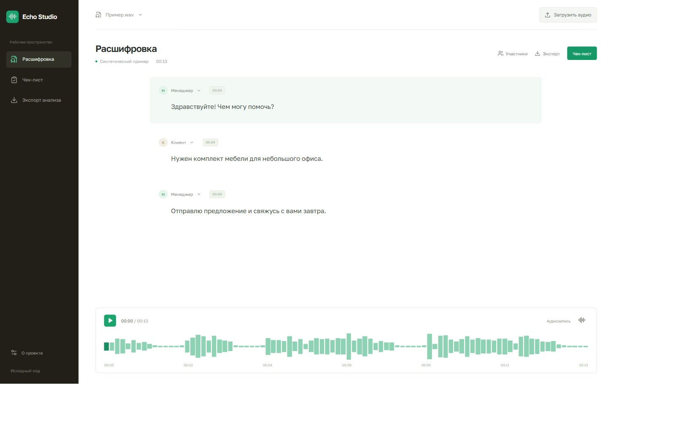

# Echo Studio

Разбор аудиозаписей в одном окне: расшифровка, участники разговора и чек-лист с подтверждающими репликами. Нажатие на реплику переводит запись к нужному моменту.

[](https://github.com/famelikolbut5/echo-studio/actions/workflows/ci.yml)



## Возможности

- Загрузка аудио и локальная расшифровка через faster-whisper.
- Прослушивание записи с переходом по временным меткам.
- Ручное назначение ролей менеджера и клиента.
- Проверка чек-листа по ключевым словам и экспорт результата в JSON.

## Как устроен проект

Распознавание выполняется на сервере, без отправки записи во внешний сервис. Чек-лист показывает найденную реплику и время, чтобы результат можно было проверить на слух. Роли участников можно назначить вручную.

**Стек:** Python, FastAPI, faster-whisper, React, TypeScript, Vite.

## Структура

```text
backend/        обработка аудио, расшифровка и проверка чек-листа
src/            интерфейс, состояния и работа с API
public/         синтетическая запись для первого знакомства
tests/          проверки поведения серверной части
docs/           запуск, проверки и материалы проекта
Dockerfile      сборка интерфейса и серверного приложения
compose.yml     локальный запуск с сохранением данных
```

## Запуск

Нужны Git и Docker. Каждый проект запускается отдельно на порту 8000.

```sh
git clone https://github.com/famelikolbut5/echo-studio.git
cd echo-studio
docker compose up --build
```

Откройте [localhost:8000](http://localhost:8000). [Запуск без Docker и настройки](docs/RUNNING.md).

## Состав демоверсии

В комплекте есть синтетическая запись с подготовленной расшифровкой. Можно загрузить собственное аудио и запустить распознавание на сервере.

[Проверки и результаты](docs/VALIDATION.md) | [Лицензии зависимостей и материалов](THIRD_PARTY.md) | [MIT](LICENSE)
